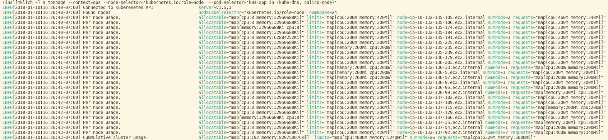

# tonnage

>Tonnage is a small utility to summarize the resource capacity and allocation of a Kubernetes cluster. It will inspect pods on a per node basis and then provide both per-node and cluster-wide summary of the resources that are allocatable vs. what has _actually been_ allocated (requests and limits).
>
>This inspection can be cluster wide or you can use [label selectors](https://kubernetes.io/docs/concepts/overview/working-with-objects/labels/) to inspect a subset of nodes, pods, or both.



## Table of contents
  * [Installation](#installation)
     * [Source install](#source-install)
     * [Binary install](#binary-install)
  * [Usage](#usage)
     * [Targeting clusters](#targeting-clusters)
     * [Label Selectors](#label-selectors)
        * [Node Selection](#node-selection)
        * [Pod Selection](#pod-selection)
  * [Development](#development)
    * [Dependencies](#dependencies)
  * [TODO](#todo)
  * [Contributing](#contributing)
  * [License](#license)

## Installation

### Source install
#### Requirements
* A working [Go](https://golang.org/) install (tested with 1.8 and 1.9)
* [dep](https://github.com/golang/dep)

```
$ go get github.com/elementalvoid/tonnage
$ cd ${GOPATH}/src/github.com/elementalvoid/tonnage
$ dep ensure
$ go install github.com/elementalvoid/tonnage
```

### Binary install
See [TODO](#todo)

## Usage

```
$ tonnage -h 
```

### Targeting clusters
Tonnage accepts a `--context` parameter which will cause the client to use the specified "context" from the kubectl configuration file (`kubecfg`).
```
$ tonnage --context=minikube
```
```
$ tonnage --context=prod-us-east-1
```

### Label Selectors
Label selectors can reduce the inspection to a subset or nodes, pods, or both. This can be handy to summarize tainted nodes, or to see resource consumption from a certain team or set of applications.

From the Kubernetes docs on Labels:
>Equality- or inequality-based requirements allow filtering by label keys and values. Matching objects must satisfy all of the specified label constraints, though they may have additional labels as well. Three kinds of operators are admitted =,==,!=. The first two represent equality (and are simply synonyms), while the latter represents inequality. For example:
>```
>environment = production
>tier != frontend
>```

>Set-based label requirements allow filtering keys according to a set of values. Three kinds of operators are supported: in,notin and exists (only the key identifier). For example:
>```
>environment in (production, qa)
>tier notin (frontend, backend)
>partition
>!partition
>```

#### Node selection:
```
$ tonnage --node-selector='kubernetes.io/role=node,taint.company.com/app-role=sensitive'
```

#### Pod selection
All pods with the label `releaseVersion`.
```
$ tonnage --pod-selector='releaseVersion'
```


Only kube-dns and calico-node pods:
```
$ tonnage --pod-selector='k8s-app in (kube-dns, calico-node)'
```


## Development
### Dependencies
Dependency management uses the [dep](https://github.com/golang/dep) project.
```
$ dep ensure
```

## TODO
* Automated (binary) builds.
* Tests.
* Limit by namespace.
* Separate scanning from reporting.
  * Save scans for later.
  * Save whole scan? Doing so would mean not using built-in k8s selector support if we want to be able to load a scan _and_ further reduce it via selectors.
* Allow simulating different allocatable resources to answer questions like "What would happen if I used a different AWS/GCE instance type?"

## Contributing
Pull requests are welcome. For major changes, please open an issue first to discuss what you would like to change.

Please make sure to update tests as appropriate.

1. Fork it (<https://github.com/elementalvoid/tonnage/fork>)
2. Create your feature branch (`git checkout -b feature/fooBar`)
3. Commit your changes (`git commit -am 'Add some fooBar'`)
4. Push to the branch (`git push origin feature/fooBar`)
5. Create a new Pull Request

## License
[Apache 2.0](https://choosealicense.com/licenses/apache-2.0/)