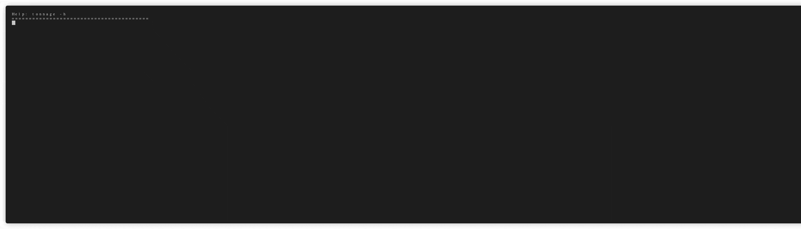

# tonnage
### GitHub Actions Status
[](https://github.com/elementalvoid/tonnage/actions/workflows/go.yaml)
[](https://github.com/elementalvoid/tonnage/actions/workflows/golangci-lint.yaml)
[](https://github.com/elementalvoid/tonnage/actions/workflows/codeql.yaml)
[](https://github.com/elementalvoid/tonnage/actions/workflows/goreleaser.yaml)
### Other status
[](https://goreportcard.com/report/github.com/elementalvoid/tonnage)
[](https://github.com/elementalvoid/tonnage/releases)
[](https://github.com/elementalvoid/tonnage/blob/main/LICENSE)

---

>Tonnage is a small utility to summarize the resource capacity and allocation of a Kubernetes cluster.
>It will inspect pods on a per node basis and then provide both per-node and cluster-wide summary of
>the resources that are allocatable vs. what has _actually been_ allocated (requests and limits).
>
>This inspection can be cluster wide or you can use
>[label selectors](https://kubernetes.io/docs/concepts/overview/working-with-objects/labels/) to
>inspect a subset of nodes, pods, or both.



## Table of contents
  * [Installation](#installation)
     * [Source install](#source-install)
     * [Binary install](#binary-install)
  * [Usage](#usage)
     * [Targeting clusters](#targeting-clusters)
     * [Label Selectors](#label-selectors)
        * [Node Selection](#node-selection)
        * [Pod Selection](#pod-selection)
  * [Development](#development)
    * [Testing](#testing)
  * [TODO](#todo)
  * [Contributing](#contributing)
  * [License](#license)
  * [Thanks](#thanks)

## Installation

### Source install
#### Requirements

* A working [Go](https://golang.org/) install (tested only with 1.22)

A particular release:
```
$ go install github.com/elementalvoid/tonnage@v0.1.0
```

Latest release:
```
$ go install github.com/elementalvoid/tonnage@latest
```

### Binary install
Every release provides binary releases. These can be manually downloaded and installed.

* Download your [desired version](https://github.com/elementalvoid/tonnage/releases)
* Unpack it (tar -xzvf tonnage-v0.0.2-linux-amd64.tgz)
* Find the tonnage binary and move it to your desired location
(mv linux-amd64/tonnage /usr/local/bin/tonnage)

As long as it's in your shell's path you should be able to run it: `tonnage -h`

## Kubernetes version support

`tonnage` is currently built with the v1.30 Kubernetes client. For a full support matrix please
reference the [client-go compatibility chart](https://github.com/kubernetes/client-go#compatibility-matrix). 

## Usage

```
$ tonnage -h 
```

### Targeting clusters
Tonnage accepts a `--context` parameter which will cause the client to use the specified "context"
from the kubectl configuration file (`kubecfg`).
```
$ tonnage --context=minikube
```
```
$ tonnage --context=prod-us-east-1
```

### Label Selectors
Label selectors can reduce the inspection to a subset or nodes, pods, or both. This can be handy to
summarize tainted nodes, or to see resource consumption from a certain team or set of applications.

From the Kubernetes docs on Labels:
>Equality- or inequality-based requirements allow filtering by label keys and values. Matching objects
>must satisfy all of the specified label constraints, though they may have additional labels as well.
>Three kinds of operators are admitted =,==,!=. The first two represent equality (and are simply
>synonyms), while the latter represents inequality. For example:
>```
>environment = production
>tier != frontend
>```

>Set-based label requirements allow filtering keys according to a set of values. Three kinds of
>operators are supported: in,notin and exists (only the key identifier). For example:
>```
>environment in (production, qa)
>tier notin (frontend, backend)
>partition
>!partition
>```

#### Node selection:
```
$ tonnage --node-selector='kubernetes.io/role=node,taint.company.com/app-role=sensitive'
```

#### Pod selection
All pods with the label `releaseVersion`.
```
$ tonnage --pod-selector='releaseVersion'
```

Only kube-dns and calico-node pods:
```
$ tonnage --pod-selector='k8s-app in (kube-dns, calico-node)'
```

## Development
Dependency management is done with go modules. Release builds are created with
[goreleaser](https://goreleaser.com/). Testing is done with unit tests and 
[GolangCI-Lint](https://github.com/golangci/golangci-lint).

### Testing
#### Go test
```
go test -v ./
```

#### golangci-lint
A `golangci-list` configuration file is available. Simply run:
```
golangci-list run
```

## TODO
- [x] Automated (binary) builds.
- [ ] Tests.
- [x] Limit by namespace.
- [ ] Separate scanning from reporting.
  * Save scans for later?
  * Save whole scan? Doing so would mean not using built-in k8s selector support if we want to be
  able to load a scan _and_ further reduce it via selectors.

## Contributing
Pull requests are welcome. For major changes, please open an issue first to discuss what you would
like to change.

Please make sure to update tests as appropriate.

1. Fork it (<https://github.com/elementalvoid/tonnage/fork>)
2. Create your feature branch (`git checkout -b feature/fooBar`)
3. Commit your changes (`git commit -am 'Add some fooBar'`)
4. Push to the branch (`git push origin feature/fooBar`)
5. Create a new Pull Request

## License
[Apache 2.0](./LICENSE)

## Thanks
* [mpb](github.com/vbauerster/mpb) -- A _wonderful_ Golang progress bar.
* [tablewriter](github.com/olekukonko/tablewriter) -- Made everything pretty!
* [go-humanize](github.com/dustin/go-humanize) -- Awesome number formatting for lazy people.
* [Terminalizer](https://terminalizer.com/) -- Made capturing the demo gif _super_ simple!
* [GIFCompressor](https://gifcompressor.com/) -- Like a GIF Shrink-o-matic.
